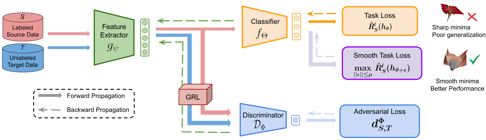

# <div align="center">Smooth Domain Adversarial Training</div>

<font size = "3">**Harsh Rangwani\*, Sumukh K Aithal\*, Mayank Mishra, Arihant Jain, R. Venkatesh Babu**</font>


This is the official PyTorch implementation for our ICML'22 paper: **A Closer Look at Smoothness in Domain Adversarial Training**.[[`Paper`](https://arxiv.org/abs/2206.08213)] 


[](https://paperswithcode.com/sota/domain-adaptation-on-office-home?p=a-closer-look-at-smoothness-in-domain-1) [](https://paperswithcode.com/sota/domain-adaptation-on-visda2017?p=a-closer-look-at-smoothness-in-domain-1)

## Introduction
<div align="center">
  
</div>

<p align="justify">In recent times, methods converging to smooth optima have shown improved generalization for supervised learning tasks like classification. In this work, we analyze the effect of smoothness enhancing formulations on domain adversarial training, the objective of which is a combination of task loss (eg. classification, regression etc.) and adversarial terms. We find that converging to a smooth minima with respect to (w.r.t.) task loss stabilizes the adversarial training leading to better performance on target domain. In contrast to task loss, our analysis shows that converging to smooth minima w.r.t. adversarial loss leads to sub-optimal generalization on the target domain. Based on the analysis, we introduce the Smooth Domain Adversarial Training (SDAT) procedure, which effectively enhances the performance of existing domain adversarial methods for both classification and object detection tasks. </p>

**TLDR:** Just do a few line of code change to improve your adversarial domain adaptation algorithm by converting it to it's smooth variant. 

### Why use SDAT?
- Can be combined with any DAT algorithm.
- Easy to integrate with a few lines of code.
- Leads to significant improvement in the accuracy of target domain.
<!-- #### DAT Based Method
 ```

# optimizer refers to the standard SGD optimizer which contains parameters of the feature extractor and classifier.
optimizer.zero_grad()
# ad_optimizer refers to standard SGD optimizer which contains parameters of domain classifier.
ad_optimizer.zero_grad()

class_prediction, feature = model(x)
task_loss = task_loss_fn(class_prediction, label)
domain_loss = domain_classifier(feature)
loss = task_loss + domain_loss
loss.backward()

# Update parameters  of feature extractor and classifier
optimizer.step()
# Update parameters of domain classifier
ad_optimizer.step()
``` -->

#### DAT Based Method w/ SDAT
We provide the details of changes required to convert any DAT algorithm (eg. CDAN, DANN, CDAN+MCC etc.) to it's Smooth DAT version.

```python
optimizer = SAM(classifier.get_parameters(), torch.optim.SGD, rho=args.rho, adaptive=False,
                    lr=args.lr, momentum=args.momentum, weight_decay=args.weight_decay, nesterov=True)
# optimizer refers to the Smooth optimizer which contains parameters of the feature extractor and classifier.
optimizer.zero_grad()
# ad_optimizer refers to standard SGD optimizer which contains parameters of domain classifier.
ad_optimizer.zero_grad()

# Calculate task loss
class_prediction, feature = model(x)
task_loss = task_loss_fn(class_prediction, label)
task_loss.backward()

# Calculate ϵ̂ (w) and add it to the weights
optimizer.first_step()

# Calculate task loss and domain loss
class_prediction, feature = model(x)
task_loss = task_loss_fn(class_prediction, label)
domain_loss = domain_classifier(feature)
loss = task_loss + domain_loss
loss.backward()

# Update parameters (Sharpness-Aware update)
optimizer.step()
# Update parameters of domain classifier
ad_optimizer.step()
```

## Getting started

* ### Requirements
	<ul>
	<li>pytorch 1.9.1</li>
	<li>torchvision 0.10.1</li>
	<li>wandb 0.12.2</li>
	<li>timm 0.5.5</li>
	<li>prettytable 2.2.0</li>
	<li> scikit-learn </li>
	</ul>
* ### Installation
```
git clone https://github.com/val-iisc/SDAT.git
cd SDAT
pip install -r requirements.txt
```
We use Weights and Biases ([wandb](https://wandb.ai/site)) to track our experiments and results. To track your experiments with wandb, create a new project with your account. The ```project``` and ```entity``` arguments in ```wandb.init``` must be changed accordingly. To disable wandb tracking, the ```log_results``` flag can be used. 

* ### Datasets
   The datasets used in the repository can be downloaded from the following links:
	   <ul>
	   <li>[Office-Home](https://www.hemanthdv.org/officeHomeDataset.html)</li><li>[VisDA-2017](https://github.com/VisionLearningGroup/taskcv-2017-public) (under classification track)</li><li>[DomainNet](http://ai.bu.edu/M3SDA/)</li>
	   </ul>
	The datasets are automatically downloaded to the ```data/``` folder if it is not available.
## Training
We report our numbers primarily on two domain adaptation methods: CDAN w/ SDAT and CDAN+MCC w/ SDAT. The training scripts can be found under the `examples` subdirectory. 

### Domain Adversarial Training (DAT)
To train using standard CDAN and CDAN+MCC, use the `cdan.py` and `cdan_mcc.py` files, respectively. Sample command to execute the training of the aforementioned methods with a ViT B-16 backbone,  on Office-Home dataset (with Art as source domain and Clipart as the target domain) can be found below. 
```
python cdan_mcc.py data/office-home -d OfficeHome -s Ar -t Cl -a vit_base_patch16_224 --epochs 30 --seed 0 -b 24 --no-pool --log logs/cdan_mcc_vit/OfficeHome_Ar2Cl --log_name Ar2Cl_cdan_mcc_vit --gpu 0 --lr 0.002 --log_results
```

### Smooth Domain Adversarial Training (SDAT)

To train using our proposed CDAN w/ SDAT and CDAN+MCC w/ SDAT, use the `cdan_sdat.py` and `cdan_mcc_sdat.py` files, respectively. 

 A sample script to run CDAN+MCC w/ SDAT with a ViT B-16 backbone, on Office-Home dataset (with Art as source domain and Clipart as the target domain) is given below. 
```
python cdan_mcc_sdat.py data/office-home -d OfficeHome -s Ar -t Cl -a vit_base_patch16_224 --epochs 30 --seed 0 -b 24 --no-pool --log logs/cdan_mcc_sdat_vit/OfficeHome_Ar2Cl --log_name Ar2Cl_cdan_mcc_sdat_vit --gpu 0 --rho 0.02 --lr 0.002 --log_results
```
Additional commands to reproduce the results can be found from `run_office_home.sh` and `run_visda.sh` under `examples`.

### Results
We following table reports the accuracy score across the various splits of Office-Home and VisDA-2017 datasets using CDAN+MCC w/ SDAT with VIT B-16 backbone. We also provide downloadable weights for the corresponding pretrained classifier. 
<div align="center">
<table>
    <thead>
        <tr>
            <th>Dataset</th>
            <th>Source</th>
            <th>Target</th>
            <th>Accuracy</th>
            <th>Checkpoints</th>
        </tr>
    </thead>
    <tbody>
        <tr>
            <td rowspan=12> Office-Home</td>
            <td>Art</td>
            <td>Clipart</td>
            <td>70.8</td>
            <td><a href="https://drive.google.com/uc?export=download&id=1KAXa9OpRAh_5pMDslbQdiZAm0rd98oY3">ckpt</a>
            </td>
        </tr>
        <tr>
            <td>Art</td>
            <td>Product</td>
            <td>80.7</td>
            <td><a href="https://drive.google.com/uc?export=download&id=1uYewbS7T-MIJTAyEXnDGsTdDHqpRxhOB">ckpt</a></td>
        </tr>
        <tr>
            <td>Art</td>
            <td>Real World</td>
            <td>90.5</td>
            <td><a href="https://drive.google.com/uc?export=download&id=1fWwc7eFjdozn_5tbtJAFVfd7D7D6-4eJ">ckpt</a></td>
        </tr>
        <tr>
            <td>Clipart</td>
            <td>Art</td>
            <td>85.2</td>
	    <td><a href="https://drive.google.com/uc?export=download&id=1VjEmev3Q5itkjF2xaBEBkkZoJ-gHHX3q">ckpt</a></td>
        </tr>
        <tr>
            <td>Clipart</td>
            <td>Product</td>
            <td>87.3</td>
            <td><a href="https://drive.google.com/uc?export=download&id=1f19ilEM4DnN3_-n9nf0e6F0ViIB-qcmZ">ckpt</a></td>
        </tr>
        <tr>
            <td>Clipart</td>
            <td>Real World</td>
            <td>89.7</td>
            <td><a href="https://drive.google.com/uc?export=download&id=1EZKBMj4LMrUZKV6_I4FPb7bD_fCxv4W-">ckpt</a></td>
        </tr>
        <tr>
            <td>Product</td>
            <td>Art</td>
            <td>84.1</td>
            <td><a href="https://drive.google.com/uc?export=download&id=1woKuqUay_qSEOLLKF924zA-QYKFek214">ckpt</a></td>
        </tr>
        <tr>
            <td>Product</td>
            <td>Clipart</td>
            <td>70.7</td>
            <td><a href="https://drive.google.com/uc?export=download&id=16b-EEqDtEVPmuRd89QbQmLtkS3HO7H4T">ckpt</a></td>
        </tr>
         <tr>
            <td>Product</td>
            <td>Real World</td>
            <td>90.6</td>
            <td><a href="https://drive.google.com/uc?export=download&id=1S7Dm0raEg8WtelOKI2I_xwGFBA0S5Rsc">ckpt</a></td>
        </tr>
        <tr>
            <td>Real World</td>
            <td>Art</td>
            <td>88.3</td>
            <td><a href="https://drive.google.com/uc?export=download&id=1oGOYcJ0SMQH6vXVeU7krs3uhXOIygeha">ckpt</a></td>
        </tr>
        <tr>
            <td>Real World</td>
            <td>Clipart</td>
            <td>75.5</td>
            <td><a href="https://drive.google.com/uc?export=download&id=1pjf7V5RWG7kjtGj4bYJOwltDP9UwAJA2">ckpt</a></td>
        </tr>
         <tr>
            <td>Real World</td>
            <td>Product</td>
            <td>92.1</td>
            <td><a href="https://drive.google.com/uc?export=download&id=1gI6TXw0V-9iXM30SGu2AyMaHp1NZqS8c">ckpt</a></td>
        </tr>
         <tr>
	         <td rowspan=12>VisDA-2017</td>
            <td>Synthetic</td>
            <td>Real</td>
            <td>89.8</td>
            <td><a href="https://drive.google.com/uc?export=download&id=1-jusx3NM510pC7aOjO5cCGSB-Ywvcgst">ckpt</a></td>
        </tr>
    </tbody>
</table>
</div>

### Evaluation
To evaluate a classifier with pretrained weights, use the `eval.py` under `examples`. Set the `--weight_path` argument with the path of the weight to be evaluated. 

A sample run to evaluate the pretrained ViT B-16 with CDAN+MCC w/ SDAT on Office-Home (with Art as source domain and Clipart as the target domain) is given below.
```
python eval.py data/office-home -d OfficeHome -s Ar -t Cl -a vit_base_patch16_224 -b 24 --no-pool --weight_path path_to_weight.pth --log_name Ar2Cl_cdan_mcc_sdat_vit_eval --gpu 0 --phase test
```
A sample run to evaluate the pretrained ViT B-16 with CDAN+MCC w/ SDAT on VisDA-2017 (with Synthetic as source domain and Real as the target domain) is given below.

```
python eval.py data/visda-2017 -d VisDA2017 -s Synthetic -t Real -a vit_base_patch16_224 --per-class-eval --train-resizing cen.crop --weight_path path_to_weight.pth --log_name visda_cdan_mcc_sdat_vit_eval --gpu 0 --no-pool --phase test
```


## Overview of the arguments
Generally, all scripts in the project take the following flags
- `-a`: Architecture of the backbone. (resnet50|vit_base_patch16_224)
- `-d`: Dataset (OfficeHome|DomainNet) 
- `-s`: Source Domain
- `-t`: Target Domain
- `--epochs`: Number of Epochs to be trained for.
- `--no-pool`: Use --no-pool for all experiments with ViT backbone.
- `--log_name`: Name of the run on wandb.
- `--gpu`: GPU id to use.
- `--rho`: $\rho$ value in SDAT (Applicable only for SDAT runs).

## Acknowledgement
Our implementation is based on the [Transfer Learning Library](https://github.com/thuml/Transfer-Learning-Library). We use the PyTorch implementation of SAM from https://github.com/davda54/sam.
## Citation
If you find our paper or codebase useful, please consider citing us as:
```latex
@InProceedings{rangwani2022closer,
  title={A Closer Look at Smoothness in Domain Adversarial Training},
  author={Rangwani, Harsh and Aithal, Sumukh K and Mishra, Mayank and Jain, Arihant and Babu, R. Venkatesh},
 booktitle={Proceedings of the 39th International Conference on Machine Learning},
  year={2022}
}
```
